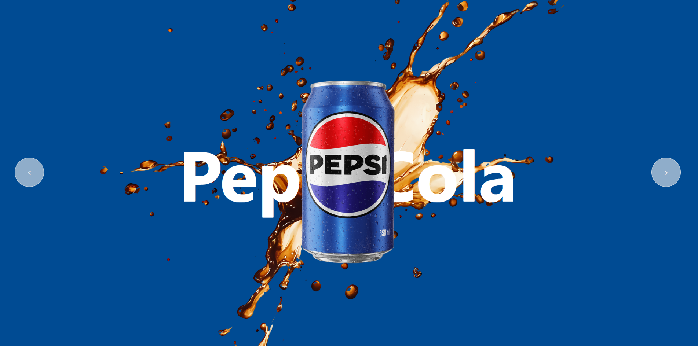

# Projeto Refresco

Página web simples que apresenta imagens de diferentes marcas de refrigerantes.

## Descrição

Este projeto exibe imagens de três marcas famosas de refrigerantes: Pepsi Cola, Coca-Cola e Guaraná. É um exemplo básico de layout com HTML, JAVASCRIPT e CSS, ideal para aprendizado e prática de desenvolvimento front-end.

## Tecnologias utilizadas

- HTML
- CSS
- JAVASCRIPT

## Visual do projeto

## Como acessar

O projeto está hospedado no GitHub Pages e pode ser acessado pelo link:

[https://dev-caua-ricken.github.io/refrigerante/](https://caua-ricken.github.io/refrigerante/)

## Estrutura do projeto

- `index.html` — arquivo principal da página.
- `style.css` — arquivo de estilos CSS.
- `index.js` — arquivo de funções.
- Imagens das marcas localizadas na pasta `imagens/`.

Feito por Cauã Ricken.
